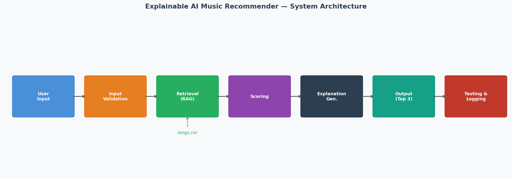

# Explainable AI Music Recommender

## Project Summary

This project evolved from a basic weighted **Music Recommender Simulation** into an **Explainable AI Music Recommender** that uses Retrieval-Augmented Generation (RAG). The original simulation scored songs with a simple weighted formula. This version separates that process into two explicit steps. First *retrieve* the most relevant songs from the dataset, then *score and explain* them using only the retrieved data, making the system more transparent and its reasoning easier to understand.

The system takes a user's **genre**, **mood**, and **energy level** as input, retrieves matching candidates from `data/songs.csv`, and returns the top 3 songs with a confidence score and a plain-language explanation grounded in each song's attributes.

---

## System Architecture



| Step | Description |
|------|-------------|
| **Input** | User provides genre, mood, and energy (0.0–1.0) |
| **Validation** | Checks genre/mood against allowed values; energy range check |
| **Retrieval (RAG)** | `src/retrieval.py` fetches candidates: exact matches first, then partial, then fallback |
| **Scoring** | Genre match (+2.0), mood match (+1.5), energy proximity (+1.0 scaled) |
| **Explanation** | Generated from the retrieved song's actual genre, mood, energy, and description |
| **Output** | Top 3 songs with score, confidence label (High/Medium/Low), and explanation |
| **Testing & Logging** | `src/evaluation.py` runs 6 tests; all runs logged to `recommender.log` |

---

## Setup

```bash
# 1. (Optional) create a virtual environment
python -m venv .venv
source .venv/bin/activate      # Mac/Linux
.venv\Scripts\activate         # Windows

# 2. Install dependencies
pip install -r requirements.txt

# 3. Run the app
python app.py
```

### Run tests

```bash
pytest
```

### Run evaluation

```bash
python src/evaluation.py
```

---

## Sample Inputs and Outputs

**Example 1 — Pop / Happy / High Energy**
```
Enter genre  : pop
Enter mood   : happy
Enter energy : 0.8

Top 3 Recommendations:

1. Sunrise City by Neon Echo
   Score: 4.48 [High confidence]
   Because: matches your genre (pop); fits your mood (happy); has similar energy (0.82); Upbeat pop anthem with bright synths...

2. Rooftop Lights by Indigo Parade
   Score: 2.74 [Medium confidence]
   Because: fits your mood (happy); has similar energy (0.76); Indie pop gem with jangly guitars...

3. Gym Hero by Max Pulse
   Score: 2.57 [Medium confidence]
   Because: matches your genre (pop); Gym Hero is a hard-hitting pop banger...
```

**Example 2 — Lofi / Chill / Low Energy**
```
Enter genre  : lofi
Enter mood   : chill
Enter energy : 0.4

1. Midnight Coding by LoRoom      Score: 4.48 [High]
2. Library Rain by Paper Lanterns Score: 4.30 [High]
3. Spacewalk Thoughts by Orbit B. Score: 2.62 [Medium]
```

**Example 3 — Fallback (no exact match)**
```
Enter genre  : synthwave
Enter mood   : relaxed
Enter energy : 0.6

Retrieved 6 candidate(s) matching genre/mood...

1. Night Drive Loop by Neon Echo   Score: 2.85 [Medium]
   Because: matches your genre (synthwave); Nostalgic synthwave with pulsing basslines...
```

---

## Design Decisions and Trade-offs

| Decision | Reason | Trade-off |
|----------|--------|-----------|
| RAG over pure scoring | Explanations are grounded in real song data, not generated freely | Requires good descriptions in the dataset |
| Simple weighted score | Transparent and easy to audit | Cannot capture subtle taste patterns |
| Fallback to partial matches | System always returns *something* useful | Lower-confidence results when no exact match |
| Confidence labels (High/Medium/Low) | Users can calibrate how much to trust a result | Thresholds are hand-tuned, not learned |

---

## Testing Summary

Six automated tests cover normal use (pop, lofi, rock, jazz, ambient) and one fallback case (synthwave + relaxed, which has no exact match in the dataset).

```
6/6 tests passed, all cases handled correctly
```

The fallback test returned a Medium-confidence result rather than nothing, the system degrades gracefully rather than failing.

---

## Limitations and Risks

- **Tiny dataset (10 songs):** The catalog is too small to represent real musical diversity. Gaps in genre/mood coverage are common.
- **No lyric or audio understanding:** Scores depend entirely on hand-labelled attributes. Two songs with the same genre/mood/energy labels are treated as identical.
- **Attribute bias:** Genres with more catalog entries will appear in recommendations more often, even when they are not the best match.
- **Overtrusting recommendations:** A "High confidence" label can mislead users into thinking the system deeply understands their taste. It only means the song attributes matched well, not that the user will enjoy it.

---

## Responsible AI Reflection

**Limitations:** This system reflects whatever biases exist in how songs were labelled. A labeller who finds "lofi" synonymous with "studying music" will create a dataset that steers all study-mood queries toward lofi, regardless of whether a jazz or ambient track would serve the user better.

**Possible misuse:** Recommenders can create filter bubbles. A system that always returns the same genre because it scores highest will reduce exposure to new styles, the opposite of discovery. In a real product this could be harmful at scale.

**Testing surprise:** The evaluation revealed that data quality matters more than algorithm complexity. When the dataset had good genre/mood coverage, even the simple weighted scorer produced High-confidence results. When coverage was missing (synthwave + relaxed), no amount of scoring logic could compensate.

**AI collaboration:**
- *Helpful suggestion:* Claude suggested separating retrieval from scoring as two distinct steps, which made the RAG behavior explicit and the explanation logic much cleaner.
- *Overly complex suggestion:* An early suggestion added cosine similarity over all numeric attributes (tempo, valence, danceability, acousticness). This made scores harder to interpret and did not meaningfully improve results on a 10 song dataset, a premature optimization.

---

## Reflection

Building this recommender made the mechanics of real systems like Spotify's "Discover Weekly" concrete. What looks like magic is just a scoring function over labelled attributes, and the labels are the real work. The biggest lesson was that bias enters early, at the data-labelling stage, long before any algorithm runs. A system that seems "smart" can be confidently wrong if its training data reflects only a narrow slice of musical taste.

Human judgment still matters in deciding what attributes to capture, how to label them, and what "good" looks like, none of that is automatic.

---

[**Model Card**](model_card.md)
